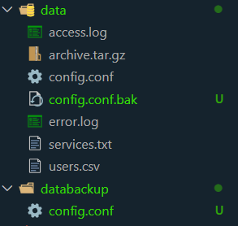

# Answer questions here
# 1. Find the IP address with the most errors in access.log.
The command(s) used: grep ' 4' access.log | awk '{print $1}' | sort | uniq -c | sort -nr | head -1
The output: 2 192.168.1.1
A brief explanation: Lệnh này sẽ giúp tìm ra IP có số lỗi tìm nhất trong file access.log với các mã lỗi HTTP bắt đầu là 4..

# 2. List all usernames that do not use /bin/bash from users.csv.
The command(s) used: awk -F, '$3 != "/bin/bash" {print $1 "," $2}' users.csv
The output: user2,User Two
            user3,User Three
A brief explanation: Lệnh này sẽ giúp lọc ra các dòng của file users.csv mà cột thứ 3 được xác định bởi dấu "," không phải là "/bin/bash", và sẽ in ra cột 1 và 2.

# 3. Use sed to update config.conf and compare the changes.
The command(s) used: cp config.conf config.conf.bak
                     sed -i 's/8080/5050/g' config.conf.
                     diff config.conf.bak config.conf
The output: 3c3
            < port=5050
            ---
            > port=8080
A brief explanation: Bước đầu sẽ copy toàn bộ nội dung trong file sang file backup, sau đó sẽ thay đổi nội dung trong file backup và so sánh toàn bộ nội dung của 2 file.

# 4. Search for timeout errors in all .log files.
The command(s) used: grep -i "error" *.log
The output: error.log:[2025-05-28 14:00:00] ERROR Something bad happened
A brief explanation: Lệnh này sẽ giúp tìm lấy ra dòng có lỗi là từ "error" không phân biệt in hoa, in thường trong tất cả các file là 
".log".

# 5. Count the occurrences of each error type in error.log.
The command(s) used: awk '{print $3}' error.log | sort | uniq -c | sort -nr
The output: 1 WARNING
            1 ERROR
A brief explanation: lệnh này sẽ giúp lấy ra số lượng của từng loại lỗi, cụ thể là lấy số lượng và tên lỗi là cột thứ 3.

# 6. Find the process consuming the most CPU.
The command(s) used: ps aux --sort=-%cpu | head -5
The output: 
USER         PID %CPU %MEM    VSZ   RSS TTY      STAT START   TIME COMMAND
ntt1902     1610  2.3  7.7 54962316 615620 pts/0 Sl+  12:53   1:54 /home/ntt1902/.vscode-server/bin/848b80aeb52026648a8ff9f7c45a9b0a80641e2e/node --dns-result-order=ipv4first /home/ntt1902/.vscode-server/bin/848b80aeb52026648a8ff9f7c45a9b0a80641e2e/out/bootstrap-fork --type=extensionHost --transformURIs --useHostProxy=true
ntt1902     1538  0.1  1.2 1328636 102976 pts/0  Sl+  12:53   0:07 /home/ntt1902/.vscode-server/bin/848b80aeb52026648a8ff9f7c45a9b0a80641e2e/node /home/ntt1902/.vscode-server/bin/848b80aeb52026648a8ff9f7c45a9b0a80641e2e/out/server-main.js --host=127.0.0.1 --port=0 --connection-token=3655248312-2339183993-3569853821-1210813037 --use-host-proxy --without-browser-env-var --disable-websocket-compression --accept-server-license-terms --telemetry-level=all
root           7  0.1  0.0   3496   240 ?        Sl   12:51   0:06 plan9 --control-socket 7 --log-level 4 --server-fd 8 --pipe-fd 10 --log-truncate
ntt1902      873  0.1  0.1  10948  9776 pts/2    S    12:51   0:06 zsh
A brief explanation: Lệnh này sẽ giúp tìm ra các tiến trình chiếm nhiều nhất được lọc theo cột "%CPU" và chỉ lấy 5 dòng đầu.

# 7. Use rsync to back up .conf files, excluding any containing *default*.
The command(s) used: rsync -av --exclude='*default*' --include='*.conf' --exclude='*' data/ databackup/
The output: 
A brief explanation: Lệnh này sẽ giúp sao chép các file có đuôi là ".conf" vào folder mới có tên là databackup, còn các file khác sẽ không được sao chép vào.

# 8. Filter out non-duplicate lines between access.log and error.log.
The command(s) used: 
The output:
A brief explanation:

# 9. Search for the word dummy inside archive.tar.gz.
The command(s) used: zgrep -i "dummy" archive.tar.gz
The output: This is a dummy tar.gz file content.
A brief explanation: Lệnh này sẽ giúp lấy ra dòng có từ chỉ định là "dummy" từ file .gz mà không cần phải giải nén trực tiếp

# 10. Check and start the nginx service, then filter logs containing "fail".
The command(s) used: sudo systemctl start nginx
                     journalctl -u nginx | grep -i "fail"
The output: 
A brief explanation: Lệnh này sẽ giúp lấy các dịch dụ từ nginx bằng 'journalctl -u nginx' sau đó sẽ lọc các thông báo có lỗi là "fail". Nhưng hiện tại hệ thống kh có dịch vụ lỗi nào.